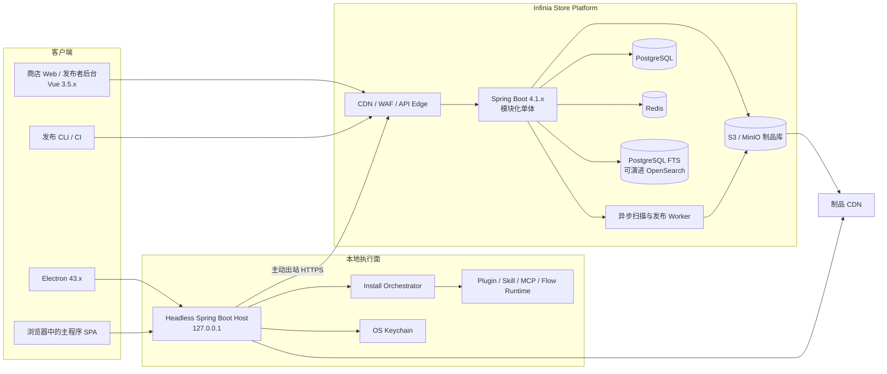
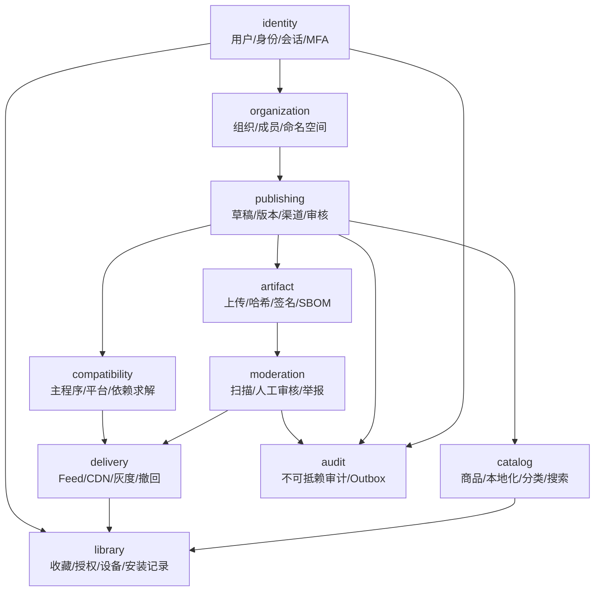
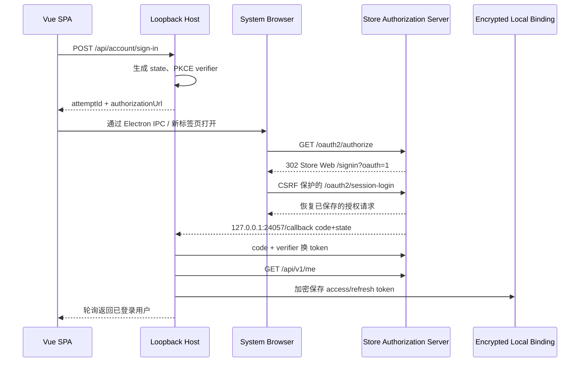
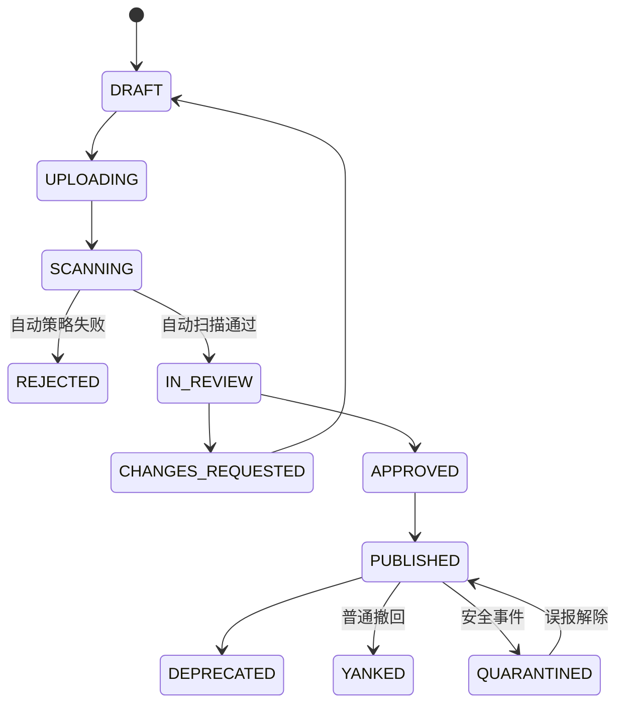
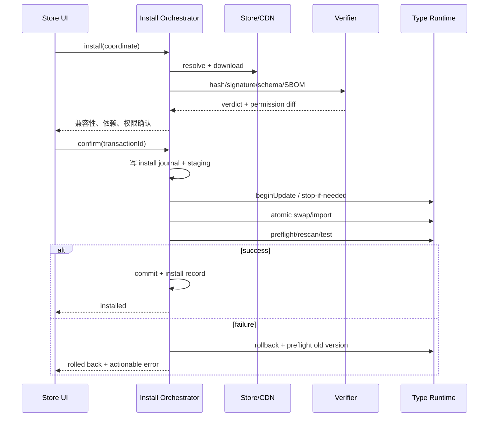

# Infinia 商店与用户平台完整设计稿

> 状态：架构设计提案<br>
> 面向版本：Infinia / FengYu 4.x 及后续版本<br>
> 文档日期：2026-08-26<br>
> 目标读者：产品、架构、后端、前端、桌面端、插件工具链、运维与安全团队

## 1. 结论摘要

本设计在现有 Infinia 4.x 的本地优先架构上新增一个独立部署的 **Infinia Store Platform**，统一承载：

- 主程序版本发现、灰度发布、更新与回滚；
- FengYu 插件（`.fyp`）、技能（`.fys`）、MCP 模板和 Flow 的发布、审核、搜索、安装与更新；
- 用户注册登录、第三方身份、设备、组织、发布者、收藏、订阅和审计；
- 制品签名、哈希、SBOM、兼容性、权限差异和依赖闭包管理；
- 面向主程序、浏览器商店、发布者后台和管理员后台的一组版本化 API。

核心架构决策如下：

1. **云端控制面与本地执行面分离。** 商店负责身份、目录、制品和发布策略；本地主程序继续绑定 `127.0.0.1`，负责实际安装、权限确认、进程启停和回滚。
2. **先做模块化单体，不先拆微服务。** 商店后端采用独立版本线的 Spring Boot 4.1.x 模块化单体；使用领域事件与 Outbox 保留未来拆分能力。
3. **“Spring 4.1.x”解释为 Spring Boot 4.1.x。** 当前仓库已使用 Spring Boot 4.1.0、Spring Framework 7.0.8 和 Spring AI 2.0.0。Spring 官方当前展示的 Boot 版本为 4.1.1；不得误用已停止维护的 Spring Framework 4.1.x。
4. **Vue 保持唯一前端运行时。** 商店 Web 和主程序商店界面采用当前稳定 Vue 3.5.41，并锁定 `3.5.x` 小版本；Vite、TypeScript、Pinia、Vue Router 与测试工具通过 Yarn 4 锁文件管理。
5. **Magic UI 采用受控 Vue 端口。** Magic UI 官方实现基于 React、TypeScript、Tailwind CSS 与 Motion，不能直接作为 Vue 组件依赖。经 MIT 许可证核验后，在项目内维护 `@infinia/magic-ui-vue` 端口，保留来源、许可证和视觉行为测试，不在同一页面引入 React 运行时。
6. **统一目录，不统一执行器。** APP、PLUGIN、SKILL、MCP、FLOW 共用商品、版本、签名、审核和检索模型，但安装必须路由到各自已有或专用执行器。
7. **账号不是本地后端的入站认证。** Electron/浏览器到 loopback 后端仍使用现有 `X-FengYu-Token`；云账号令牌只用于本地主程序主动访问商店，避免把本地服务暴露为公网资源服务器。

## 2. 依据与版本基线

### 2.1 仓库现状

| 能力 | 当前实现 | 设计中的处理 |
|---|---|---|
| 主程序 | Spring Boot headless server + Vue SPA + Electron shell | 保留；只增加商店客户端和账号绑定 |
| 主程序更新 | `UpdateCheckService`、`SelfUpdateService`、Electron updater | 将 GitHub 直连逐步替换为签名更新 Feed，保留模式分流 |
| 插件 | `.fyp`、隔离 iframe、JSON-RPC Worker、权限/签名/回滚 | 直接复用 `PluginPackageService`、`InstallerDispatcher` 和运行时健康检查 |
| 技能 | `.fys`、`SKILL.md`、内置/安装来源、启停/更新 | 直接复用 `SkillPackageService`，补统一商品与签名元数据 |
| MCP | STDIO、SSE、Streamable HTTP 动态配置和实时重连 | 商店发布“安全模板”，安装后默认禁用并等待用户补充机密 |
| Flow | 本地草稿、发布版本、不可变 revision、恢复与运行 | 增加可移植包、依赖锁、商店 release；本地发布与公开发布分开 |
| 统一商店 | `PluginStoreController` 聚合 FengYu/Claude/Codex/Grok | 保留兼容层，升级为五类制品统一 Catalog API |
| 用户 | `SysUserEntity` / `SysSessionEntity` 基础结构、Noop 身份、虚拟用户 1 | 新增云端账号域和本地绑定；不直接复用虚拟用户作为云端主体 |
| 前端 | Vue 3.5.39、Vite 7、Pinia 4、Vuetify 3、Yarn 4 | 新商店区域升级到 Vue 3.5.41；Magic UI Vue 端口渐进接入 |

仓库事实来源：[`pom.xml`](pom.xml)、[`frontend/package.json`](frontend/package.json)、[`PluginStoreController.java`](FengYu/src/main/java/fan/summer/fengyu/web/controller/PluginStoreController.java)、[`McpRuntimeManager.java`](FengYu/src/main/java/fan/summer/fengyu/ai/mcp/McpRuntimeManager.java)、[`WorkflowService.java`](FengYu/src/main/java/fan/summer/fengyu/ai/workflow/WorkflowService.java)。

### 2.2 外部技术基线

- [Spring Boot 官方项目页](https://spring.io/projects/spring-boot) 当前展示 4.1.1；后端固定在 `4.1.x` 维护线，并始终使用该线最新安全补丁。
- [Vue 官方发布页](https://vuejs.org/about/releases) 当前稳定版本为 3.5.41；应用锁定 `3.5.x`，由锁文件保证编译器和运行时一致。
- [Magic UI 官方站点](https://magicui.design/) 明确说明组件基于 React、TypeScript、Tailwind CSS 与 Motion。
- [Magic UI 官方仓库](https://github.com/magicuidesign/magicui) 使用 MIT 许可证，允许在保留许可证与归属信息的前提下进行 Vue 端口实现。

## 3. 范围

### 3.1 本期范围

- 公共商店、主程序内嵌商店、个人资料和“我的库”；
- APP / PLUGIN / SKILL / MCP / FLOW 五类商品；
- 用户、组织、命名空间、发布者、审核员、管理员；
- OAuth 2.1/OIDC 登录、设备管理、会话撤销和可选 MFA；
- 发布草稿、版本、审核、签名、渠道、灰度、撤回和安全下架；
- 搜索、分类、标签、兼容性筛选、收藏、安装记录；
- 本地原子安装、权限差异确认、健康检查与回滚；
- API、Webhook、审计、指标、日志和告警。

### 3.2 非目标

- 首版不做付费、分账、税务和退款；数据模型预留 `entitlement`，但免费制品默认产生免费授权。
- 首版不允许商店远程无提示安装或强制更新本地扩展。
- 首版不上传用户聊天、工作流运行输入、MCP 机密或插件私有数据。
- 首版不把插件 Worker 改回进程内，也不改变 iframe / JSON-RPC 隔离边界。
- 首版不把模块化单体提前拆成大量网络服务。

## 4. 总体架构



### 4.1 信任边界

| 边界 | 信任规则 |
|---|---|
| Renderer → loopback Host | 继续使用每次启动生成/注入的 `X-FengYu-Token`；不接受商店 access token 替代 |
| Host → Store API | OAuth access token + TLS；未登录时只访问匿名目录和公开更新 Feed |
| Host → CDN | HTTPS + 制品 SHA-256 + Ed25519 签名双重校验 |
| Host → Plugin Worker | 现有 JSON-RPC stdio、权限门和 OS 隔离；更新期间使用 runtime gate |
| Host → MCP | 安装模板不等于授权；机密只在本地，连接和工具启用均需用户确认 |
| Publisher → Store | OAuth/OIDC + 组织角色；发布动作必须签名、审计并通过扫描策略 |

## 5. 后端架构

### 5.1 部署与代码组织

商店平台应拥有独立版本线，不能继承主程序 `${revision}`，也不能与独立插件工具链版本混用。推荐在当前仓库先放置为独立构建根，稳定后可无痛迁移到独立仓库：

```text
store-platform/
├── pom.xml                         # 独立 revision 与 Spring Boot 4.1.x BOM
├── store-application/              # 唯一可部署 Spring Boot 应用
├── store-domain/                   # 纯领域模型与策略
├── store-infrastructure/           # JPA、对象存储、邮件、搜索、Outbox
├── store-contract/                 # OpenAPI DTO、事件 Schema、客户端生成契约
├── store-scanner/                  # 解包、SBOM、恶意内容与兼容性扫描
└── store-web/                      # Vue 3.5.x 商店/发布者/管理员前端
```

首个生产部署只有 `store-application` 和可横向扩容的 `store-scanner` 两类进程。模块之间禁止跨模块直接访问 Repository，使用应用服务、领域事件或明确的 SPI。

### 5.2 Spring 家族选型

| 领域 | 技术 | 用途 |
|---|---|---|
| 基座 | Spring Boot 4.1.x、Java 21 | 配置、Actuator、依赖治理、容器运行 |
| Web | Spring MVC、Bean Validation、Problem Details | REST API、上传会话、错误协议 |
| 安全 | Spring Security、OAuth2 Authorization Server、Resource Server、OAuth2 Client | 用户、OIDC、PKCE、设备授权、API 令牌 |
| 数据 | Spring Data JPA、Spring Data Redis | PostgreSQL 聚合、缓存、限流、一次性状态 |
| 模块 | Spring Modulith | 模块边界、应用事件、模块测试、文档化 |
| 异步 | Spring Task / Batch + Transactional Outbox | 扫描、索引、邮件、Webhook、发布流水线 |
| 可观测性 | Actuator、Micrometer、OpenTelemetry | 健康、指标、Trace、审计关联 |
| API 文档 | springdoc-openapi 兼容版本 | OpenAPI 3.1 与客户端生成；必须先核验 Boot 4.1 兼容线 |

所有 Spring 子项目版本均由 Boot BOM 或明确且受维护的 BOM 管理，不在业务模块散落版本号。

### 5.3 领域模块



主要约束：

- `catalog` 只展示已批准且在目标渠道可见的 release；
- `artifact` 的 Blob 一旦完成不可变，版本修复必须发布新 release；
- `publishing` 不直接删除已发布版本，只能撤回、弃用或安全下架；
- `delivery` 只返回与客户端版本、操作系统、架构和渠道兼容的版本；
- `library` 的安装事件是遥测，不能反向成为本地是否安装的唯一事实来源。

## 6. 统一商品与制品模型

### 6.1 通用模型

```text
Namespace 1 ── * Listing 1 ── * Release 1 ── * Artifact
                           ├── * Dependency
                           ├── * CompatibilityRule
                           ├── * PermissionDeclaration
                           ├── 1 ReviewDecision
                           └── * ChannelAssignment
```

| 对象 | 关键字段 |
|---|---|
| `listing` | `id`, `namespace`, `slug`, `type`, `visibility`, `status`, `defaultChannel`, `publisherId` |
| `listing_i18n` | `locale`, `name`, `summary`, `descriptionMarkdown`, `changelogMarkdown` |
| `release` | `version`, `status`, `publishedAt`, `minHostVersion`, `maxHostVersion`, `license`, `sourceUrl` |
| `artifact` | `kind`, `platform`, `arch`, `size`, `sha256`, `signature`, `keyId`, `blobKey`, `sbomKey` |
| `dependency` | `targetNamespace`, `targetSlug`, `targetType`, `semverRange`, `optional`, `capability` |
| `permission` | `permissionId`, `scope`, `required`, `reason` |
| `channel` | `stable/beta/alpha/nightly/private`, `rolloutPercent`, `minClientCohort` |

全局商品标识使用：

```text
infinia://<type>/<namespace>/<slug>@<semver>
```

示例：`infinia://plugin/official/markdown@4.0.0-beta.5`。

### 6.2 五类商品差异

| 类型 | 发布物 | 安装目标 | 默认行为 | 更新策略 |
|---|---|---|---|---|
| `APP` | Electron 平台包、portable JAR、checksums、签名、SBOM | 应用安装目录 | 只检查，不静默重启 | 渠道 + 灰度 + 平台/架构 |
| `PLUGIN` | `.fyp` | `~/.fengyu/plugins/<id>` | 安装后按清单启用；高风险权限先确认 | 原子替换、Worker 预检、失败回滚 |
| `SKILL` | `.fys` | `~/.fengyu/skills/<id>` | 纯指导文本；内置 Skill 不可覆盖 | 原子替换、重新扫描 Registry |
| `MCP` | MCP 模板清单，可选签名辅助二进制 | 本地 MCP Registry | **默认禁用**；提示补齐 command/url/secret | 保存新定义、测试连接、成功后切换 |
| `FLOW` | `.fyflow` JSON/ZIP + 依赖锁 | 本地 workflow DB | 导入为当前用户的新副本，默认未发布 | 三方合并不可控，采用“安装新 revision/另存副本” |

### 6.3 通用发布清单

商店 API 使用统一 envelope，各原生包格式仍保持权威：

```json
{
  "schemaVersion": 1,
  "coordinate": "infinia://flow/summer/mail-digest@1.2.0",
  "type": "FLOW",
  "version": "1.2.0",
  "channel": "stable",
  "requiresHost": ">=4.0.0-beta.5 <5.0.0",
  "artifacts": [
    {
      "url": "https://cdn.example/sha256/ab/cd...",
      "sha256": "...",
      "signature": "...",
      "keyId": "publisher-2026-01",
      "size": 48123
    }
  ],
  "dependencies": [
    {
      "coordinate": "infinia://plugin/official/email",
      "range": ">=4.0.0-beta.5 <5.0.0",
      "optional": false
    },
    {
      "coordinate": "infinia://mcp/official/calendar",
      "range": "^1.0.0",
      "optional": true
    }
  ],
  "permissions": [],
  "publishedAt": "2026-08-26T10:00:00Z"
}
```

### 6.4 MCP 商店清单

MCP 商品发布的是**配置模板和受审查的安装方案**，不是可直接获得用户机密的远程配置：

```json
{
  "schemaVersion": 1,
  "id": "official.calendar",
  "name": "Calendar MCP",
  "transport": "STREAMABLE_HTTP",
  "urlTemplate": "https://mcp.example.com/mcp",
  "requiredSecrets": [
    { "name": "authorization", "target": "header", "sensitive": true }
  ],
  "defaultEnabled": false,
  "toolPolicy": { "enabledByDefault": false },
  "networkHosts": ["mcp.example.com"]
}
```

禁止在模板中携带明文 token、动态 shell 拼接、未固定版本的远程安装脚本或任意可写系统路径。STDIO MCP 若需运行时，必须声明平台、架构、哈希、签名和启动参数 Schema。

### 6.5 Flow 可移植格式

`.fyflow` 至少包含：

```text
manifest.json           # 商品、版本、作者、兼容范围、入口
workflow.json           # inputSchema、plan、graph、layout
dependencies.lock.json  # 精确依赖版本、能力和内容哈希
README.md               # 使用说明
assets/                 # 仅允许安全媒体/示例；总大小受限
```

发布时从当前 `WorkflowRevisionEntity` 的不可变快照生成包，不从未发布草稿生成。安装时：

1. 校验 Schema、哈希、签名和 Host 兼容性；
2. 求解插件、技能和 MCP 依赖；
3. 展示缺失依赖、权限并让用户逐项确认；
4. 导入为新的本地 workflow id，记录 `sourceCoordinate` 和 `sourceReleaseId`；
5. 保持 `published=false`，用户检查后再在本地发布；
6. 更新时若用户未改动可替换来源 revision；存在本地修改则导入为新副本并展示差异。

## 7. 用户与组织系统

### 7.1 身份模型

云端用户系统是商店平台的一部分；本地主程序的数据所有权与云身份分开：

- `store_user`：商店全局主体；
- `external_identity`：GitHub、Google、企业 OIDC 等外部身份；
- `credential`：可选的本地密码/Passkey/MFA 凭据；
- `organization` / `organization_member`：团队发布与权限；
- `namespace`：商品名称所有权，避免抢注；
- `device` / `authorization_grant`：主程序设备和授权；
- 本地新增 `cloud_account_binding`：保存云端 subject、展示信息、同步状态，以及经本机绑定
  AES-GCM 信封加密的 access/refresh token；部署方可通过 `FENGYU_MACHINE_KEY` 从 OS Keychain
  注入主密钥材料。

现有 `SysUserEntity` 和虚拟用户 `id=1` 暂时继续负责本地数据库行归属。首版账号登录**不迁移或切换**本地聊天、Flow、插件数据的 owner，避免登出或换号造成数据不可见及跨账号泄露。若未来支持多本地 Profile，应另立迁移项目。

### 7.2 登录流程

桌面应用使用 OAuth 2.1 Authorization Code + PKCE：



约束：

- 回调固定为精确注册的 `http://127.0.0.1:24057/callback`，listener 仅在登录尝试期间存在，
  严格验证 `state` 和 redirect URI；
- Host 请求 `openid profile offline_access`；Store 的 `fengyu-desktop` 客户端必须同时允许
  authorization-code、refresh grant 和这三个 scope，否则首次登录成功后不会签发 refresh token；
- Store Web 的 `http://localhost:8089/signin` 是唯一产品登录界面；OAuth 模式使用 `?oauth=1`
  和受 CSRF 保护的 session-login bridge 恢复原授权请求。后端 `/login` 仅做弃用重定向，
  不得重新启用 Spring 默认表单页；
- access/refresh token 不进入 renderer 或日志；写入本地绑定前使用本机绑定 AES-GCM 信封加密，
  `FENGYU_MACHINE_KEY` 是 OS Keychain 注入点；
- 纯 headless 模式使用 OAuth Device Authorization Grant；
- 浏览器商店使用 `HttpOnly + Secure + SameSite` 会话 Cookie 和 CSRF 保护；
- 发布 CLI 使用短期 Device Flow 或作用域受限的 Personal Access Token，PAT 只存哈希。

### 7.3 角色与权限

| 角色 | 权限摘要 |
|---|---|
| `USER` | 浏览、收藏、获取免费授权、管理自己的设备与会话 |
| `PUBLISHER` | 在所属 namespace 创建商品、上传草稿、提交审核 |
| `ORG_ADMIN` | 管理组织、成员、namespace、发布密钥和 Webhook |
| `REVIEWER` | 查看扫描结果、批准/拒绝/请求修改，不得审核自己的 release |
| `PLATFORM_ADMIN` | 安全下架、封禁、密钥吊销、全局策略；所有操作强审计 |

权限使用资源级 RBAC：`subject + organization + namespace + action`。管理员和审核员要求 MFA；高风险操作要求近期重新认证。

### 7.4 账号功能

- 注册、邮箱验证、登录、登出、找回、MFA/Passkey；
- GitHub/Google/OIDC 绑定与解绑；
- 活跃会话、设备、最近 IP/地区、单设备撤销和全局登出；
- 组织邀请、成员角色、命名空间申请与转移；
- 发布者资料、隐私政策、服务条款、支持链接；
- 我的收藏、已获取制品、安装历史、更新偏好；
- 账号导出与删除；审计记录按合规策略保留并去标识化。

## 8. 发布、审核与交付

### 8.1 发布状态机



`YANKED` 版本不再提供给新安装，但已安装客户端仍能读取元数据和迁移说明；`QUARANTINED` 版本必须进入本地阻断列表，并可建议用户禁用/回滚，仍不得静默删除本地文件。

### 8.2 上传与扫描流水线

1. 客户端创建 upload session，服务端返回短时预签名 URL；
2. 对象存储完成上传后回调，平台流式计算大小、SHA-256 和 MIME；
3. 进入隔离区，限制解压文件数、单文件大小、总膨胀率和路径；
4. 验证原生 manifest、统一 envelope、SemVer、命名空间和兼容范围；
5. 生成/验证 SBOM，执行恶意文件、已知漏洞、许可证和敏感信息扫描；
6. 对插件检查权限与上一版本差异；对 Flow 解析依赖闭包；对 MCP 检查命令与网络目标；
7. 扫描通过后进入人工或自动审核；
8. 批准时平台签署 release 元数据，Blob 以内容哈希为键转入不可变发布区；
9. 写 Outbox 事件，异步更新搜索索引、CDN、Feed、邮件和 Webhook。

### 8.3 签名与密钥

- 发布者可用自己的 Ed25519 密钥签署上传物；平台再对审核后的 release envelope 作平台签名；
- APP 必须具备平台代码签名、`checksums.txt` 和 Ed25519 元数据签名；
- 公钥有 `keyId`、有效期、用途和吊销状态；私钥在 KMS/HSM 中，不进入数据库或 CI 日志；
- 客户端内置根公钥并支持签名密钥轮换包；根密钥轮换要求双签过渡；
- `sha256` 用于内容完整性，签名用于来源真实性，两者都必须通过；
- 所有 release 生成 CycloneDX 或 SPDX SBOM，并保存扫描器版本和策略版本。

### 8.4 主程序更新 Feed

```http
GET /api/v1/updates/app?current=4.0.0-beta.5&channel=beta&os=macos&arch=arm64&installId=<opaque>
```

响应包含：`latestVersion`、`mandatory=false`、`rollout`、`releaseNotes`、`artifacts[]`、`sha256`、`signature`、`keyId`、`publishedAt`、`minimumSupportedVersion`。服务端用 `HMAC(installId)` 做稳定灰度分桶，不使用账号、邮箱或 IP 参与分桶。

迁移步骤：

1. 保持当前 GitHub Releases 路径作为 fallback；
2. Store Feed 聚合 GitHub release 元数据并返回现有 `UpdateInfo` 兼容字段；
3. Electron 改为 Store 托管的通用更新 Feed，portable JAR 继续走后端下载/校验/重启；
4. 稳定后移除客户端对 GitHub API 的直接依赖，CDN 回源仍可使用 release assets；
5. 任何强制更新只表示“停止提供云服务前要求升级”，不得绕过本地确认直接替换程序。

## 9. 安装、更新与回滚

### 9.1 本地 Install Orchestrator

在现有 `InstallerDispatcher` 上方增加统一编排层：

```text
StoreClient
  → ReleaseResolver
  → CompatibilityChecker
  → DependencySolver
  → DownloadManager
  → IntegrityVerifier
  → PermissionDiffService
  → TypeInstaller(APP | PLUGIN | SKILL | MCP | FLOW)
  → InstallJournal
  → Audit/Notification
```

类型安装器不得互相绕过：

- `PluginTypeInstaller` 适配现有 `PluginPackageService` 和 runtime update gate；
- `SkillTypeInstaller` 适配 `SkillPackageService` 和 `SkillRegistry`；
- `McpTypeInstaller` 适配 `McpRuntimeManager`，先保存禁用配置，再测试和启用；
- `FlowTypeInstaller` 调用新增的 workflow import 服务和 revision 记录；
- `AppTypeInstaller` 只路由到 Electron updater 或 `SelfUpdateService`。

### 9.2 事务流程



### 9.3 权限升级

- 首次安装展示完整权限、进程类型、网络域名、文件范围和数据保留策略；
- 更新只展示 diff，但新增或扩大权限必须再次确认；
- 签名密钥变化、发布者变化、依赖新增和 MCP 网络目标变化同样视为升级；
- 用户拒绝升级时保留旧版本，并允许关闭该商品的更新提醒；
- 安全下架不能自动获得删除本地数据的权限。

### 9.4 依赖求解

- SemVer 范围采用仓库已有 `SemanticVersion` / `SemanticVersionRange` 语义；
- 求解输入包含 Host、OS、arch、Java/Node/Python 能力、已装版本和渠道；
- 优先选择同渠道、已签名、非撤回、最小满足版本；
- 依赖图必须无环；Flow → Plugin/Skill/MCP 可以，扩展不得依赖 Flow；
- 生成 lock，后续更新可解释“为什么升级”；
- MCP 依赖缺少用户机密时可完成“安装但未配置”，Flow 保持不可运行状态并明确提示。

## 10. API 设计

### 10.1 API 约定

- 根路径 `/api/v1`；破坏性变更发布 `/api/v2`，不以 Header 隐式切换；
- JSON 使用 camelCase、UTC RFC 3339 时间、UUIDv7/ULID 标识；
- 错误使用 `application/problem+json`，包含稳定 `code`、`traceId` 和可本地化参数；
- 列表使用 cursor 分页；搜索条件可复制到 URL；
- 写接口支持 `Idempotency-Key`；并发更新使用 `ETag/If-Match`；
- 上传走预签名 URL，不让大制品穿过应用 JVM；
- OpenAPI 3.1 是客户端契约源，生成 TypeScript 和 Java client；
- 所有管理写操作进入审计，敏感值在日志和 Trace 中强制脱敏。

### 10.2 主要端点

| 域 | 方法与路径 | 用途 |
|---|---|---|
| 身份 | `POST /auth/register`, `POST /oauth2/token`, `GET /api/v1/me` | 注册、授权、当前用户 |
| 会话 | `GET/DELETE /api/v1/me/sessions/{id}` | 查看和撤销会话 |
| 设备 | `GET/DELETE /api/v1/me/devices/{id}` | 设备授权管理 |
| 目录 | `GET /api/v1/catalog` | 类型、分类、兼容性、查询、排序、分页 |
| 商品 | `GET /api/v1/listings/{namespace}/{slug}` | 商品详情和渠道版本 |
| 解析 | `POST /api/v1/resolutions` | 按客户端环境求解版本和依赖 |
| 下载 | `POST /api/v1/releases/{id}/download-ticket` | 短时、限用途 CDN 下载票据 |
| 库 | `GET /api/v1/me/library`, `PUT/DELETE .../favorites/{listingId}` | 我的库与收藏 |
| 遥测 | `POST /api/v1/install-events` | 可选、批量、幂等的安装结果 |
| 发布 | `POST /api/v1/publisher/listings` | 创建商品 |
| 上传 | `POST /api/v1/publisher/releases/{id}/uploads` | 创建上传会话 |
| 审核 | `POST /api/v1/publisher/releases/{id}/submit` | 提交审核 |
| 管理 | `POST /api/v1/reviews/{id}/decisions` | 审核决定 |
| 更新 | `GET /api/v1/updates/app` | 主程序签名 Feed |
| Webhook | `POST /api/v1/organizations/{id}/webhooks` | 发布/审核/安全事件通知 |

### 10.3 现有本地 API 的演进

保留 `/api/plugin-market`、`/api/plugin-store`、`/api/skills`、`/api/mcp` 和 `/api/workflows`，避免一次性破坏前端；新增：

```text
GET  /api/store/catalog
GET  /api/store/listings/{coordinate}
POST /api/store/resolve
POST /api/store/install
POST /api/store/transactions/{id}/confirm
GET  /api/store/transactions/{id}
POST /api/store/{coordinate}/update
DELETE /api/store/{coordinate}
GET  /api/store/library

POST /api/account/sign-in
GET  /api/account/sign-in/{attemptId}
POST /api/account/sign-out
GET  /api/account/me
GET  /api/account/devices
```

本地 API 仍受 `TokenAuthFilter` 保护。控制器只做协议映射，安装事务进入应用服务，禁止在控制器中直接下载和替换文件。

## 11. 数据设计

### 11.1 云端核心表

| 表 | 说明 | 关键索引/约束 |
|---|---|---|
| `store_user` | 用户主体 | `email_normalized` 条件唯一，状态索引 |
| `external_identity` | OIDC/OAuth 身份 | `(issuer, subject)` 唯一 |
| `credential` | 密码、Passkey、MFA 元数据 | secret 加密/哈希，用户+类型索引 |
| `user_session` | 浏览器/设备会话 | token 只存哈希，过期索引 |
| `organization` | 发布组织 | `slug` 唯一 |
| `organization_member` | 组织 RBAC | `(org_id, user_id)` 唯一 |
| `namespace` | 商品命名空间 | `name` 唯一，所有权不可隐式转移 |
| `listing` | 商品 | `(namespace_id, slug, type)` 唯一 |
| `listing_i18n` | 多语言详情 | `(listing_id, locale)` 唯一 |
| `release` | 不可变版本元数据 | `(listing_id, version)` 唯一 |
| `artifact` | 内容寻址制品 | `sha256` 唯一，`blob_key` 唯一 |
| `release_artifact` | release 与平台制品 | `(release_id, platform, arch, kind)` 唯一 |
| `release_dependency` | 依赖范围 | source/target/type 索引 |
| `release_permission` | 权限声明 | release+permission 唯一 |
| `review` / `review_finding` | 自动/人工审核 | 状态、严重级别索引 |
| `channel_assignment` | 渠道与灰度 | listing+channel 唯一 |
| `favorite` | 收藏 | `(user_id, listing_id)` 唯一 |
| `entitlement` | 免费/未来付费授权 | subject+listing 唯一 |
| `device` | 主程序设备 | `(user_id, device_public_id)` 唯一 |
| `install_event` | 可选安装遥测 | 幂等键唯一，按月分区 |
| `signing_key` | 发布/平台公钥 | `key_id` 唯一，状态索引 |
| `audit_event` | 安全审计 | append-only，按月分区 |
| `outbox_event` | 事务事件 | `status,next_attempt_at` 索引 |

### 11.2 本地新增表

| 表 | 说明 |
|---|---|
| `cloud_account_binding` | 云 subject、issuer、displayName、active、lastSyncAt；不存 refresh token |
| `store_listing_cache` | ETag、locale、目录摘要和过期时间，支持离线展示 |
| `store_install_transaction` | 状态机、stage path、旧/新版本、journal、错误与恢复信息 |
| `store_install_record` | 通用 coordinate、类型、来源 release、版本、hash、enabled |
| `flow_store_origin` | 本地 workflow 与商店 release/revision 的来源关系 |
| `mcp_store_origin` | 本地 MCP server 与模板 release 的来源关系、配置完成状态 |

迁移期继续双写现有 `plugin_install_records`，读路径优先新表、缺失时回退旧表；完成迁移与验证后再单独移除双写，不能在首个版本删除旧表。

## 12. 前端与 Magic UI 设计

### 12.1 前端工程

建议形成两个应用和一个共享包：

```text
store-platform/store-web/            # 公共商店、发布者、管理员
frontend/                            # 主程序内嵌商店、账号、我的库
ui/magic-ui-vue/                     # Vue 3 + Tailwind + Motion 的受控端口
```

共享包仅提供展示组件、设计 token 和无业务状态的组合组件；API client、Pinia store、路由和权限判断留在各应用。`ui/magic-ui-vue` 必须包含 Magic UI MIT 许可证、上游 commit、端口差异记录和视觉回归用例。

### 12.2 技术栈

| 层 | 选择 |
|---|---|
| 框架 | Vue 3.5.41、`<script setup>`、严格 TypeScript |
| 构建 | Vite 7.x、Yarn 4、Corepack、锁文件不可漂移 |
| 状态 | Pinia 4：`auth`、`catalog`、`library`、`publisher`、`installTransaction` |
| 路由 | Vue Router 4，路由级代码分割和基于角色的守卫 |
| 数据 | 生成的 OpenAPI client + 小型 query cache；禁止手写重复 DTO |
| 样式 | Tailwind CSS + CSS variables + `@infinia/magic-ui-vue` |
| 动效 | Motion 的 Vue 等价实现；所有动效支持 `prefers-reduced-motion` |
| 测试 | Vitest、Vue Test Utils、Playwright、axe、截图回归 |
| 国际化 | vue-i18n 11，至少 `zh-CN` / `en` 结构对齐 |

### 12.3 与现有 Vuetify 的共存

不进行全站重写。迁移规则：

1. `/plugins` 演进为 `/store`，新页面使用 Magic UI Vue 端口；旧设置页继续使用 Vuetify；
2. 单个路由页面只选择一个主要组件体系，避免同一表单同时使用 Vuetify 与 Tailwind reset；
3. Tailwind 使用 CSS layer、类名前缀和局部入口，设计 token 映射到现有主题变量；
4. 对话框、Toast、键盘焦点、表单校验先建设统一无障碍 primitives；
5. 迁移完成前不删除 Vuetify 依赖。

### 12.4 信息架构

```text
商店
├── 发现：首页、精选、最新、分类、搜索
├── 类型：主程序、插件、技能、MCP、Flow
├── 商品详情：介绍、版本、权限、依赖、兼容性、安全、评价/举报
├── 我的库：已安装、可更新、收藏、安装历史、失败恢复
├── 发布中心：商品、版本、上传、扫描、审核、统计、密钥
├── 账号：资料、安全、身份绑定、设备、会话、组织
└── 管理：审核队列、策略、举报、安全下架、审计
```

主程序内嵌商店只显示“发现、类型、商品详情、我的库、账号”；发布中心和管理后台在外部浏览器打开。

### 12.5 页面与 Magic UI 组件映射

| 页面 | Magic UI 组件/效果 | 使用原则 |
|---|---|---|
| 发现首页 | Bento Grid、Animated Grid Pattern、Marquee | 背景动效低对比，内容优先 |
| 商品卡片 | Magic Card、Border Beam、Badge | Border Beam 只用于精选/安全警报，不在所有卡片闪动 |
| 搜索结果 | Blur Fade、Animated List | 列表虚拟化时关闭入场动效 |
| 商品详情 | Dock/Tabs、Shimmer Button、Code Comparison | 安装按钮状态明确，Shimmer 不替代 loading/disabled |
| 安装进度 | Animated List、Progress、Number Ticker | 每一步展示可读文本和失败恢复动作 |
| 更新中心 | Bento Grid、Compare、Ripple | 清楚展示权限与依赖 diff |
| 发布流水线 | Timeline、Animated Beam | Beam 仅表达状态流，不承载唯一信息 |
| 账号安全 | Magic Card、Globe/Device map 可选 | 地理信息必须标注近似值并允许关闭 |

### 12.6 关键页面状态

每个页面必须设计：loading、empty、partial、offline、unauthorized、forbidden、not-found、rate-limited、server-error。安装按钮至少包含：

```text
未安装 → 解析中 → 等待确认 → 下载中 → 校验中 → 安装中 → 健康检查 → 已安装
                                                  └→ 回滚中 → 已恢复/需人工处理
```

不可只用颜色表达状态；键盘可达、焦点可见、触控目标不小于 44px；正文和关键控件满足 WCAG 2.2 AA。装饰动效在 reduced-motion 下变为静态样式，并设置每页动效数量预算。

## 13. 安全与隐私

### 13.1 主要威胁与控制

| 威胁 | 控制 |
|---|---|
| 命名空间抢注/依赖混淆 | namespace 所有权、保留字、精确坐标、签名和 dependency lock |
| 上传恶意包 | 隔离上传区、解压限制、Schema、恶意文件/SBOM/漏洞/许可证扫描、人工审核 |
| SSRF | catalog/download/MCP URL allow policy、DNS/IP 重绑定检查、私网地址阻断、字节和超时上限 |
| Zip Slip/符号链接逃逸 | 规范化路径、拒绝绝对路径/`..`/危险 symlink、原子 staging |
| 制品被篡改 | 内容寻址、SHA-256、Ed25519 双签、CDN 后再校验 |
| 权限静默扩大 | release permission diff，新增权限强确认 |
| 恶意 MCP | 默认禁用、机密本地化、工具逐项启用、命令和域名约束、调用审批 |
| 恶意 Flow | 安装不执行、依赖闭包、导入未发布、节点/表达式 Schema 校验 |
| XSS/钓鱼 | Markdown 白名单 + DOMPurify、外链提示、禁止任意 HTML/脚本 |
| OAuth 劫持 | PKCE、state、nonce、短期 code、精确 redirect URI、一次性 loopback listener |
| 令牌泄露 | access token 内存化、refresh token Keychain、服务端只存 token hash、日志脱敏 |
| 更新供应链 | 平台签名、代码签名、SBOM、灰度暂停、密钥吊销与客户端阻断列表 |

### 13.2 隐私原则

- 匿名浏览和公开更新检查不要求账号；
- `installId` 为随机不透明标识，只用于稳定灰度，可在设置中重置；
- 安装遥测默认最小化并允许关闭，不上传本地路径、Flow 内容、MCP 配置或聊天数据；
- IP 只用于安全风控并按短周期截断/删除；
- 用户删除账号时异步清理个人数据，安全审计按法规保留并去标识化；
- 发布者查看聚合数据必须满足最小样本阈值，不能追踪单个设备。

## 14. 可用性、性能与运维

### 14.1 SLO

| 指标 | 初始目标 |
|---|---|
| 目录读取可用性 | 月度 99.9% |
| 登录与 token 端点可用性 | 月度 99.95% |
| Catalog API p95 | 缓存命中 ≤ 250ms，数据库查询 ≤ 500ms |
| 更新 Feed p95 | ≤ 200ms |
| 发布元数据一致性 | 审核完成后 60 秒内全区域可见 |
| 制品完整性 | 每次下载 100% 在客户端复验 |
| RPO / RTO | PostgreSQL ≤ 5 分钟 / ≤ 60 分钟；Blob 跨区复制 |

### 14.2 缓存与降级

- CDN 缓存公开商品详情、图标、截图、签名 envelope 和不可变制品；
- Catalog 使用 ETag / `stale-while-revalidate`；本地主程序保存最近一次成功目录；
- Redis 只存可重建缓存、限流计数和短期授权状态，不能成为 release 真相源；
- 搜索故障时降级到 PostgreSQL FTS；推荐流故障时降级到最新/精选静态列表；
- 账号服务故障不影响已安装插件、技能、MCP 和 Flow 的本地运行；
- Store 故障不阻断主程序启动。

### 14.3 可观测性

- Trace 从 Edge 贯穿 Store、Outbox、Scanner 和对象存储操作；
- 业务指标：发布漏斗、扫描耗时、安装成功/回滚率、Feed 命中、签名失败、权限拒绝；
- 安全告警：异常上传、namespace 变更、管理员操作、密钥吊销、签名失败激增；
- 日志只记录 release/user/device 的内部 id，不记录 token、机密、完整本地路径；
- 审计事件 append-only，包含 actor、action、resource、before/after 摘要、IP hash、traceId。

## 15. 测试与质量门

### 15.1 后端

- 领域单元测试：状态机、SemVer、依赖求解、权限 diff、灰度分桶；
- Spring Modulith 模块边界测试，禁止循环依赖；
- Testcontainers：PostgreSQL、Redis、MinIO、OIDC 回调、Outbox 重试；
- Contract Test：OpenAPI、现有 FengYu catalog、`.fyp` / `.fys` / MCP / `.fyflow` Schema；
- 安全测试：Zip Slip、压缩炸弹、SSRF、签名错误、密钥吊销、OAuth 重放、越权；
- 更新测试：全平台 Feed、断点/损坏下载、回滚、旧客户端兼容；
- 性能测试：目录、搜索、下载票据、上传完成回调和发布突发流量。

### 15.2 前端

- 组件单测和 Storybook/Histoire 等价隔离场景；
- Magic UI Vue 端口与上游示例做截图回归；
- Playwright 覆盖注册登录、浏览、安装确认、发布、审核和回滚提示；
- axe + 键盘导航 + reduced-motion；
- 浅色/深色、中英文、窄屏/桌面、Electron/浏览器截图矩阵；
- API DTO 只从 OpenAPI 生成，CI 检查生成物无漂移。

### 15.3 供应链门禁

- Maven/Yarn lockfile 可复现；依赖必须处于维护线；
- SCA、SBOM、许可证、secret scan、容器镜像和 IaC scan；
- 发布镜像和制品签名，生产环境验证签名后部署；
- 数据库变更只走 Flyway，不依赖生产 `ddl-auto=update`；
- 不允许扫描失败被普通发布者手动忽略，例外必须双人审批和审计。

## 16. 分阶段落地计划

### Phase 0：契约与安全基础（2–3 周）

- 固化统一 coordinate、release envelope、五类 Schema 和签名规范；
- 为现有 Catalog/更新接口建立 contract tests；
- 确定 Store 独立版本线、域名、对象存储和 KMS；
- 建立 `@infinia/magic-ui-vue` 最小包、许可证和三类基础组件；
- 验收：规范评审通过，示例包可被 CLI 和 Host 同时验证。

### Phase 1：只读商店与主程序更新（4–6 周）

- Catalog、Listing、Release、Artifact、签名 Feed；
- 公共商店首页/搜索/详情；
- Host StoreClient、缓存、统一解析；
- 主程序更新 Feed 兼容现有 `UpdateInfo`，GitHub fallback 保留；
- 验收：未登录可浏览，五类商品可展示，APP 灰度和签名校验端到端通过。

### Phase 2：账号与我的库（4–6 周）

- Authorization Server、注册、OIDC、PKCE、Device Flow、设备和会话；
- Host `cloud_account_binding` + 本机绑定加密（支持 Keychain 注入主密钥）；
- 收藏、免费 entitlement、安装记录和账号页面；
- 验收：登录/登出不改变本地 owner=1 数据；撤销设备后 refresh token 立即失效。

### Phase 3：发布与安装全链路（6–10 周）

- Publisher Portal、上传、扫描、审核、签名、Webhook；
- Plugin/Skill 安装器适配；MCP 模板安装；Flow export/import 与依赖 lock；
- 原子安装 journal、权限 diff、失败恢复；
- 验收：每类制品完成发布→审核→安装→更新→回滚/卸载闭环。

### Phase 4：组织、灰度与安全运营（4–6 周）

- 组织/namespace/RBAC、审核员和安全下架；
- 渠道、灰度、密钥轮换、吊销、客户端阻断列表；
- 指标、告警、备份恢复演练；
- 验收：安全事件演练可在 15 分钟内停止新下载并通知受影响客户端。

### Phase 5：规模化（按指标触发）

- 当 PostgreSQL FTS 的 p95 或容量不满足目标时引入 OpenSearch；
- 当扫描队列或 Outbox 达到独立扩缩需求时拆分 Worker；
- 只有在模块边界和调用量证明必要时才拆 catalog、identity 或 delivery 服务；
- 评估付费 entitlement，但不让计费逻辑进入安装器和本地运行时。

## 17. 验收标准

系统完成时必须同时满足：

- 五类商品共享目录、版本、审核、签名和检索，但各自使用安全的类型安装器；
- 主程序在未登录、商店离线或账号服务故障时仍可启动和运行已装内容；
- 所有下载均校验 SHA-256 和平台签名，权限扩大必须二次确认；
- Plugin 更新失败能恢复旧 Worker；MCP 安装不携带机密且默认禁用；Flow 安装不自动执行；
- APP 更新按 Electron/portable 模式正确路由，可灰度、暂停并回滚 Feed；
- OAuth token 不进入主数据库明文、日志、URL query 或 renderer 的持久存储；
- Vue 是唯一前端运行时，Magic UI Vue 端口具有许可证、可访问性和视觉回归覆盖；
- 中英文结构一致，桌面/浏览器、浅色/深色和 reduced-motion 均通过验收；
- 审核、发布、撤回、密钥和管理员动作可按 traceId 完整追溯；
- 版本线明确分离：主程序、插件工具链、商店平台分别独立发布。

## 18. 需要在实施前冻结的 ADR

1. **ADR-001：** Store Platform 采用模块化单体及独立版本线；
2. **ADR-002：** 云身份与本地数据 owner 分离，首版不做多 Profile；
3. **ADR-003：** 通用 release envelope 与 `infinia://` coordinate；
4. **ADR-004：** MCP 仅发布模板，安装默认禁用且机密只存本地；
5. **ADR-005：** Flow 更新采用来源 revision + 本地副本，不做自动三方合并；
6. **ADR-006：** Ed25519 双签、KMS 和客户端根密钥轮换；
7. **ADR-007：** Vue-only + Magic UI MIT 受控端口，不嵌入 React runtime；
8. **ADR-008：** PostgreSQL FTS 起步，指标触发后再引入 OpenSearch；
9. **ADR-009：** 安装遥测默认最小化、可关闭、不可成为本地状态真相源；
10. **ADR-010：** 主程序更新 Feed 迁移期保留 GitHub fallback。

---

本设计优先保护 Infinia 已经成立的本地优先、loopback-only、扩展隔离和可回滚特性。商店平台扩展的是分发、身份与信任链，而不是把本地运行时改造成依赖云端才能工作的 SaaS 客户端。
